# 🎳 RLebowski

> *"This is not 'Nam. This is bowling. There are rules."* — Walter Sobchak

**RLebowski** is a reinforcement learning project for mastering **Atari Bowling** with policy gradient algorithms — REINFORCE and PPO.

The repository combines:
- a **Gymnasium environment wrapper** for Atari Bowling (`ALE/Bowling-v5`),
- policy-gradient training with **PPO**, **TRPO**, and **REINFORCE**,
- **CNN + MLP** policy network trained end-to-end in PyTorch,
- TensorBoard integration for experiment tracking.

📌 **Installation, commands, and run instructions:** see [RUNME.md](RUNME.md).

### 🎬 Trained Agent in Action

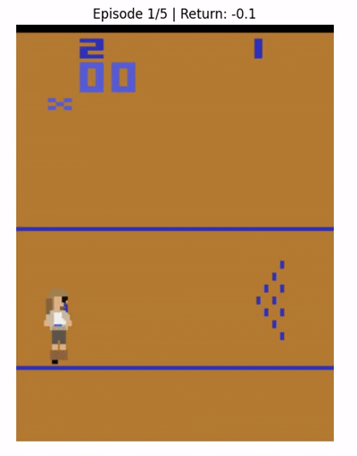

---

## 📑 Table of Contents
1. [Project Overview](#-project-overview)
2. [Simulator & Environment](#-simulator--environment)
3. [Image Processing Pipeline](#%EF%B8%8F-image-processing-pipeline)
4. [Algorithms](#-algorithms)
5. [Training](#-training)
6. [Experiments & Results](#-experiments--results)

---

## 🧩 Project Overview

- **Environment**: Atari Bowling (`ALE/Bowling-v5`, mode=2).
- **Action space**: 6 discrete actions — NOOP, FIRE, UP, DOWN, UPFIRE, DOWNFIRE.
- **Observation**: ROI crop `(1, 75, 160)` from a single color channel.
- **Policy**: CNN feature extractor + MLP head.
- **Algorithms**: REINFORCE (Monte Carlo policy gradient), PPO (Proximal Policy Optimization), and TRPO (Trust Region Policy Optimization).
- **Optimizer**: Adam, lr = `1e-3`, γ = `0.999`.

---

## 🎮 Simulator & Environment


`BowlingThrowEnv` wraps `ALE/Bowling-v5` (mode=2):
- Episode runs until natural game end (10 frames).
- Observations preprocessed to ROI tensors before being passed to the policy.

### 🕹️ Action Space

| # | Action |
|---|---|
| 0 | NOOP |
| 1 | FIRE (throw) |
| 2 | UP |
| 3 | DOWN |
| 4 | UPFIRE |
| 5 | DOWNFIRE |

### 💰 Reward Structure

- **Base**: ALE native score (pins knocked down).
- **Step penalty**: −0.001 per step.
- **Strike bonus**: +20 when single-step reward ≥ 10.

---

## 🖼️ Image Processing Pipeline

Raw Atari frames → single color channel → ROI crop → normalize.

**1. Channel extraction** — take channel 2 from the 210×160×3 RGB frame → `210×160` grayscale.

**2. ROI Crop** — rows 100–175 only; removes scoreboard and irrelevant UI:

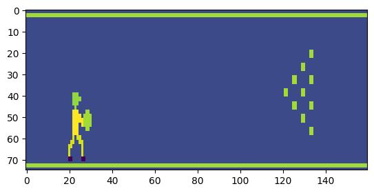

**3. Normalize** — divide by 255 → `(1, 75, 160)` float tensor in [0, 1].

```python
def preprocess(frame: np.ndarray) -> torch.Tensor:
    roi = frame[100:175, :, 2].astype(np.float32) / 255.0
    return torch.from_numpy(np.ascontiguousarray(roi)).unsqueeze(0)
```

### 🔍 CNN + MLP Policy Network

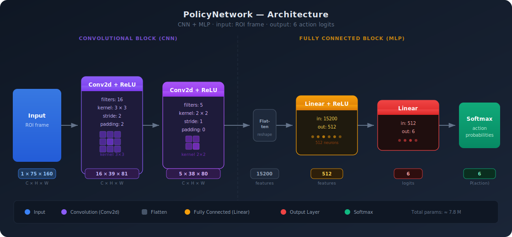

CNN learns spatial features (ball edge, pin positions) and provides translation invariance — the same pin pattern is recognized regardless of its exact lane position. The MLP head maps the extracted features to action logits.

---

## 📐 Algorithms

### Notation
- $\mathbb{S}$ — state space, $s \in \mathbb{S}$ — state; $\mathbb{A}$ — action space, $a \in \mathbb{A}$ — action.
- Environment: $S_{t+1} \sim p(\cdot\mid S_t, A_t)$
- $S_{t+1} \sim p(\cdot\mid S_t, A_t)$, $\quad A_t \sim \pi^{\theta}(\cdot\mid S_t)$, $\quad R_t \sim p^{R}(\cdot\mid S_t, A_t)$.
- Trajectory: $z_{0:\tau} = \{(s_0,a_0), \dots, (s_{\tau-1},a_{\tau-1})\}$.

**Value, Q, and advantage functions:**

$$V^\theta(s) = \mathbb{E}_{\pi^\theta}\!\left[\sum_{t=0}^{\infty} \gamma^t R_t \mid S_0 = s\right], \quad Q^\theta(s,a) = \mathbb{E}_{\pi^\theta}\!\left[\sum_{t=0}^{\infty} \gamma^t R_t \mid S_0{=}s, A_0{=}a\right]$$

$$A^\theta(s,a) = Q^\theta(s,a) - V^\theta(s)$$

### 🔁 REINFORCE

Policy objective:
```math
J(\theta) = \mathbb{E}_{\pi^\theta}\left[\sum_{t=0}^{\tau-1} \gamma^t r(S_t, A_t)\right]
```

Gradient estimator (gradient ascent on $J$):
```math
\nabla_\theta J(\theta) = \mathbb{E}_{\pi^\theta}\!\left[\sum_{t=0}^{\tau-1} \gamma^t R_t \nabla_\theta \log \pi^\theta (A_t \mid S_t)\right], \quad R_t = \sum_{k=t}^{\tau-1} \gamma^{k-t} r(S_k, A_k)
```
```math
\theta \longleftarrow \theta + \alpha \cdot \nabla_\theta J(\theta)
```

- ✅ Unbiased gradient estimates, simple implementation.
- ❌ High variance, sample-inefficient.

### 🚀 PPO (Proximal Policy Optimization)


PPO replaces hard TRPO constraints with a **clipped surrogate objective**:

```math
\hat{L}_{\text{PPO}} :=
\mathbb{E}_{T \sim \mathrm{Unif}[0, \tau_{\text{b}} - 1]}
\left[
\min \left\{
\frac{\pi_{\text{new}}(a_T \mid s_T)}{\pi_{\text{old}}(a_T \mid s_T)}
A^{\pi_{\text{old}}}(s_T, a_T),
\;
\mathrm{Clip}_{1-\epsilon}^{1+\epsilon}
\left(
\frac{\pi_{\text{new}}(a_T \mid s_T)}{\pi_{\text{old}}(a_T \mid s_T)}
\right)
A^{\pi_{\text{old}}}(s_T, a_T)
\right\}
\right]
```


### TRPO (Trust Region Policy Optimization)

TRPO enforces a hard KL-divergence constraint on policy updates:

$$D_{KL}(\pi_{old} || \pi) \le \delta$$

This prevents destructive policy collapses. The constraint is solved via conjugate gradient descent using Fisher-Vector products, followed by a backtracking line search. 
*(For full mathematical derivations and agent implementation details, see [trpo_math_implement.md](trpo_math_implement.md))*

where $A^{\pi_{\text{old}}}$ is the advantage estimate, $\epsilon$ is the clipping range, $\tau_b$ is the mini-batch size. In practice the advantage function is approximated by a learned value baseline.

- ✅ Lower variance, clipping prevents destructive updates, data reuse across epochs.

---

## 🏋️ Training

### ⚙️ Hyperparameters

| Parameter | Value |
|---|---|
| Learning rate | `1e-3` |
| Discount factor γ | `0.999` |
| Parallel envs | `5` (default) |
| PPO clip ε | `0.2` |
| PPO epochs / batch | `10` |
| PPO mini-batches | `2` |

Optimizer: **Adam** (β₁=0.9, β₂=0.999).

Each rollout is split into mini-batches and iterated over for multiple epochs (shuffled each epoch):

```
Rollout (N samples)
 ├── MB1
 ├── MB2
 ├── MB3
 └── MB4

Epoch 1:        Epoch 2:
  MB1 → step      MB3 → step
  MB2 → step      MB1 → step
  MB3 → step      MB4 → step
  MB4 → step      MB2 → step
```

---

## 📊 Experiments & Results

### REINFORCE vs PPO

| | REINFORCE | PPO |
|---|---|---|
| **Variance** | High | Low |
| **Sample efficiency** | Lower | Higher |
| **Stability** | Noisy curves | Stable |

**REINFORCE trained:**


**PPO trained:**

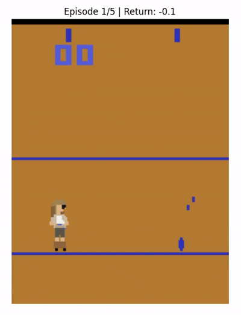

**TRPO trained:**

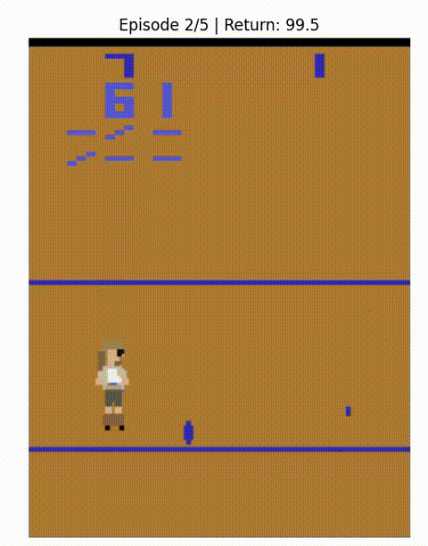

### 📈 Algorithm Performance

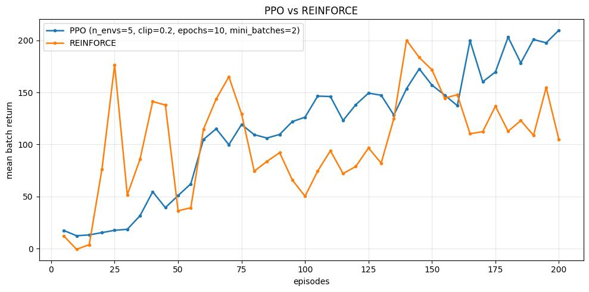

PPO achieves higher cumulative reward on the same training horizon.

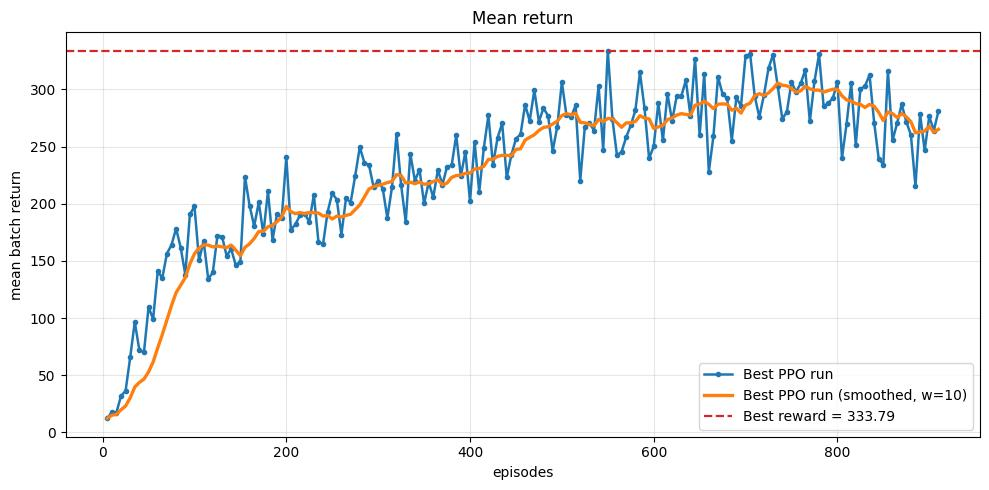

Total return with default hyperparameters.

### 🔬 PPO Hyperparameter Study

**Epochs per batch** — more epochs → smoother training and higher final returns:

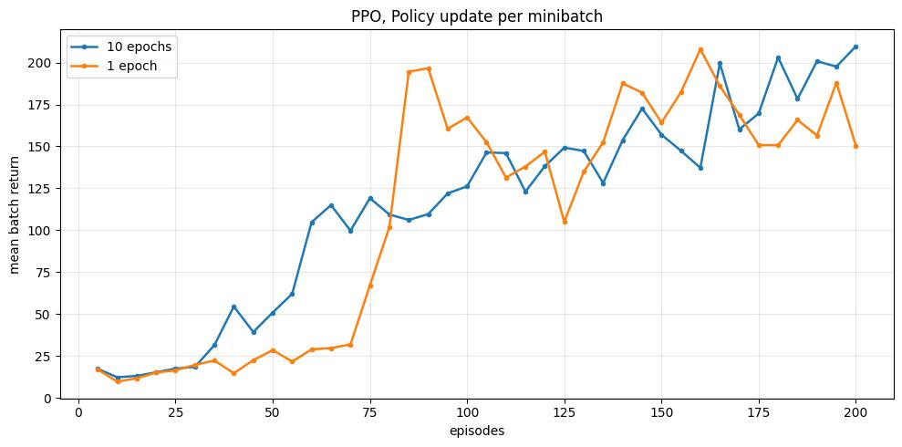

**Mini-batch size** — fewer mini-batches (1–2) converge faster; more (10+) are less noisy but slower:

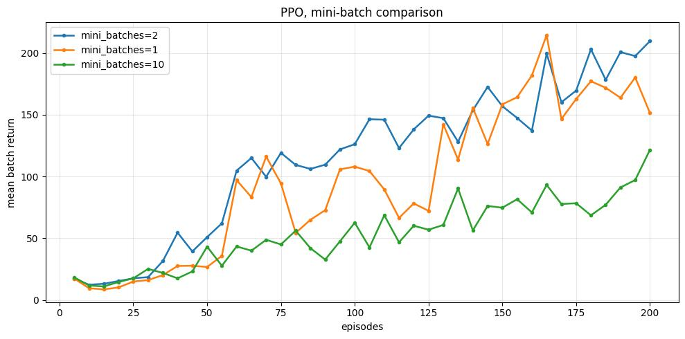

**Clipping range ε** — ε=0.2 is a compromise between ε=0.5 (noisy, fast) and ε=0.005 (smooth, slow):

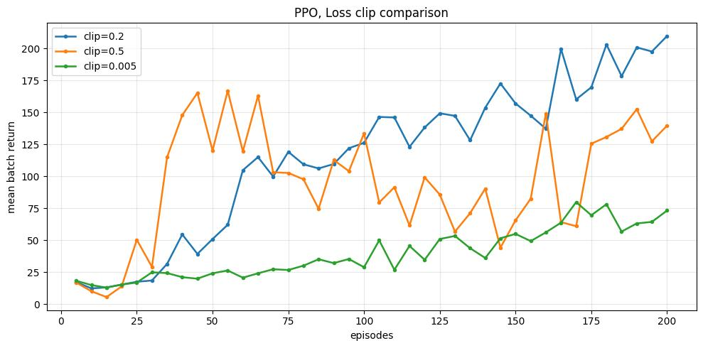

### 🔬 TRPO Training

+ Since TRPO was trained on a separate machine, its performance curve is displayed below.

 **Hyperparameters:**
<!-- --gamma = 0.999 -->
| Parameter | Value |
|---|---|
| max_kl | 0.005 |
| cg_iters | 10 |
| cg_damping | 0.1 |
| gamma | 0.999 |


+ We observed that TRPO generally underperformed compared to PPO - likely due to suboptimal hyperparameter tuning - it successfully maintained the KL divergence within the specified trust region. The surrogate loss exhibited non-monotonic behavior, which we attribute to high-variance observations resulting from hardware constraints that limited us to only two parallel environments.

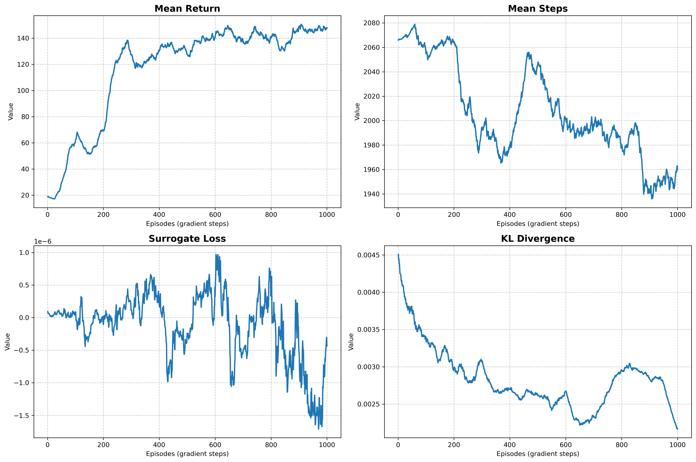

---

## 📚 References

- Schulman et al. (2017): *Proximal Policy Optimization Algorithms* ([arXiv:1707.06347](https://arxiv.org/abs/1707.06347))
- Williams (1992): *Simple Statistical Gradient-Following Algorithms for Connectionist RL*
- Sutton & Barto (2018): *Reinforcement Learning: An Introduction*
- [Gymnasium Documentation](https://gymnasium.farama.org/)

---

📝 **Project prompts:** [PROMPTME.md](PROMPTME.md)
