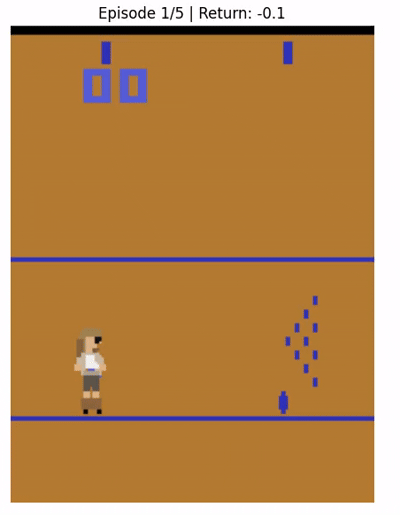

# 🎳 RLebowski

> **RLebowski** is a reinforcement learning research project for mastering **Atari Bowling** with modern policy gradient algorithms.

The repository combines:
- a **Gymnasium environment wrapper** for Atari Bowling,
- policy-gradient training with **PPO** and **REINFORCE**,
- PyTorch-based policy networks and optimization,
- TensorBoard integration for experiment tracking.

📌 **Installation, commands, and run instructions:** see [RUNME.md](RUNME.md).

---

## 📑 Table of Contents
1. [Project Overview](#project-overview)
2. [Why Bowling Is Interesting](#why-bowling-is-interesting)
3. [Algorithms](#algorithms)
4. [Environment & State Space](#environment--state-space)
5. [Training](#training)
6. [Experiments & Results](#experiments--results)
7. [Current Limitations](#current-limitations)

---

## 🧩 Project Overview

The project focuses on RL for a visual, procedural control task:
- **Environment**: Atari Bowling (Gymnasium-based).
- **Action space**: 18 discrete actions (movement, aim, throw).
- **State**: Raw pixel observations (84×84×4 with frame stacking).
- **Policy**: Multi-layer perceptron with configurable hidden layers.
- **Algorithms**: PPO (Proximal Policy Optimization) and REINFORCE (policy gradient).

**Main goals:**
- Implement clean, understandable implementations of PPO and REINFORCE.
- Achieve stable training on a continuous control task with visual input.
- Provide infrastructure for experiment tracking (TensorBoard).
- Demonstrate the practical differences between REINFORCE and PPO convergence.

---

## 💪 Why Bowling Is Interesting

Even for a simplified Atari task, bowling presents real RL challenges:

- **Visual processing**: Agent must interpret raw pixels to determine ball position, lane alignment, and pins.
- **Continuous control**: Actions are discrete but their effect on ball trajectory is highly non-linear.
- **Sparse rewards**: Success is sparse — you get a large reward only when you knock down pins.
- **Exploration-exploitation tradeoff**: Naive exploration (random actions) rarely produces meaningful scores; the agent must learn structured behavior.
- **Credit assignment**: Understanding which actions in a trajectory led to knocking down distant pins requires temporal reasoning.

From an engineering perspective:
- Pre-processing raw images for efficient learning.
- Balancing sample efficiency with computational cost.
- Stable gradient estimation under batch policy updates.

---

## 🎮 Simulator & Environment



### Environment Wrapper

The `BowlingThrowEnv` class wraps the Gymnasium Atari Bowling environment (`ALE/Bowling-v5`):
- Uses **mode=2** for the Bowling variant.
- ROI (Region of Interest) preprocessing: extracts the relevant game area from raw frames.
- Episode runs naturally until game completion (auto-termination by Bowling rules).
- All observations converted to torch tensors for GPU batch processing.

### State and Observation Format

- **Raw Atari output**: 210×160×3 RGB images per frame.
- **ROI extraction**: Crops rows 100–175 from a single color channel (channel 2).
- **Preprocessed state**: Shape `(1, 75, 160)` — single channel, height 75, width 160.
- **Network input**: Flattened to `1 * 75 * 160 = 12000` features.

The ROI captures the bowling lane and ball trajectory, removing irrelevant screen areas.

### Action Space (6 actions)

| Action Index | Meaning |
|---|---|
| 0 | NOOP (no operation) |
| 1 | FIRE (release/throw) |
| 2 | UP (vertical aim up) |
| 3 | DOWN (vertical aim down) |
| 4 | UPFIRE (aim up + throw) |
| 5 | DOWNFIRE (aim down + throw) |

No "power level" — just aim (vertical) + throw timing.

### Reward Structure

- **Base reward**: ALE native score (pins knocked down).
- **Step penalty**: –0.001 per step (encourages faster solutions).
- **Strike bonus**: +20 additional reward when strike detected (frame reward ≥ 10).
- **Episode termination**: Automatic when game ends (10 frames complete in Bowling mode).

---

## 📐 Algorithms

### REINFORCE (Monte Carlo Policy Gradient)

REINFORCE is a classic policy gradient algorithm that samples full trajectories and updates the policy based on actual returns.

**Update rule:**
```
θ ← θ + α ∇_θ log π_θ(a|s) · G_t
```

where `G_t = Σ_{k=t}^T γ^{k-t} r_k` is the discounted return from step t.

**Pros:**
- Unbiased gradient estimates.
- Simple implementation and interpretation.

**Cons:**
- High variance in gradient updates (sample inefficient).
- Can have unstable training curves.
- Single trajectory used per update.

### PPO (Proximal Policy Optimization)

PPO improves upon vanilla policy gradients using a clipped objective to prevent destructively large policy updates.

**Clipped objective:**
```
L^CLIP(θ) = E[ min(r_t(θ) A_t, clip(r_t(θ), 1-ε, 1+ε) A_t) ]
```

where:
- `r_t(θ) = π_θ(a|s) / π_{θ_old}(a|s)` is the probability ratio.
- `A_t` is the advantage estimate (with learned baseline).
- `ε` is the clipping range (typically 0.1 to 0.2).

**Advantages:**
- Lower variance through importance sampling + baseline.
- Clipping prevents overshooting; stable updates.
- Reuses data (multiple epochs per batch).
- Often converges faster and more reliably.

**In our implementation:**
- Value network (critic) learns `V(s)` to estimate returns.
- Advantage: `A_t = G_t - V(s_t)`.
- Multiple passes over batch with mini-batch updates.

---

## 📊 Training

### Policy Network Architecture

Standard **3-layer MLP**:

```
Input (12000 features from flattened 1×75×160 ROI)
        ↓
  Dense(12000 → 512)
        ↓
      ReLU
        ↓
  Dense(512 → 256)
        ↓
      ReLU
        ↓
  Dense(256 → 6)  [policy head]
        ↓
    Softmax
        ↓
  π_θ(a|s) [action probabilities over 6 actions]
```

For PPO, an additional **value head**:
```
  Dense(256 → 1)
        ↓
      V(s)  [baseline/value estimate]
```

### Hyperparameters

Default recommended settings:

**PPO:**
- Learning rate: `1e-3` to `3e-4`
- Discount factor γ: `0.99`
- Clipping range ε: `0.2`
- Optimization epochs: `10` per batch
- Mini-batch size: `32` to `64`

**REINFORCE:**
- Learning rate: `1e-4` to `1e-3` (higher variance → smaller LR helps)
- Discount factor γ: `0.99`
- No baseline (can add one for variance reduction)

### Optimization

Both algorithms use:
- **Optimizer**: Adam with default β₁=0.9, β₂=0.999
- **Batch updates**: Samples collected over N parallel environments
- **Loss**:
  - REINFORCE: `-E[log π_θ(a|s) · G_t]`
  - PPO: `L^CLIP(θ) - c_v L^VALUE(θ) + c_e H[π_θ]` (with optional entropy bonus)

---

## 📊 Experiments & Results

### Typical Training Curves


---

### 🧠 Value Function (PPO only)

The value network `V(s)` estimates the expected return from state s:

```
V(s) = E[G_t | s_t = s]
```

Trained with MSE loss:
```
L^VALUE(θ) = (V_θ(s_t) - G_t)^2
```

Advantages `A_t = G_t - V(s_t)` used for policy updates. A good value function reduces variance significantly.

---

## 🔧 Current Limitations


---

## 🚀 Future Directions

- Implement **A3C** (Asynchronous Advantage Actor-Critic) for true distributed training.
- Add **attention mechanisms** for better feature learning.
- Explore **curriculum learning** (graduated task difficulty).
- Implement **inverse models** and **curiosity-driven exploration**.
- Evaluate on other Atari environments.
- Multi-agent bowling with competitive/cooperative objectives.

---

## 📚 References

- Schulman et al. (2017): *Proximal Policy Optimization Algorithms* ([arXiv](https://arxiv.org/abs/1707.06347))
- Williams (1992): *Simple Statistical Gradient-Following Algorithms for Connectionist Reinforcement Learning*
- Sutton & Barto (2018): *Reinforcement Learning: An Introduction* (2nd ed.)
- Gymnasium Documentation: https://gymnasium.farama.org/

---
